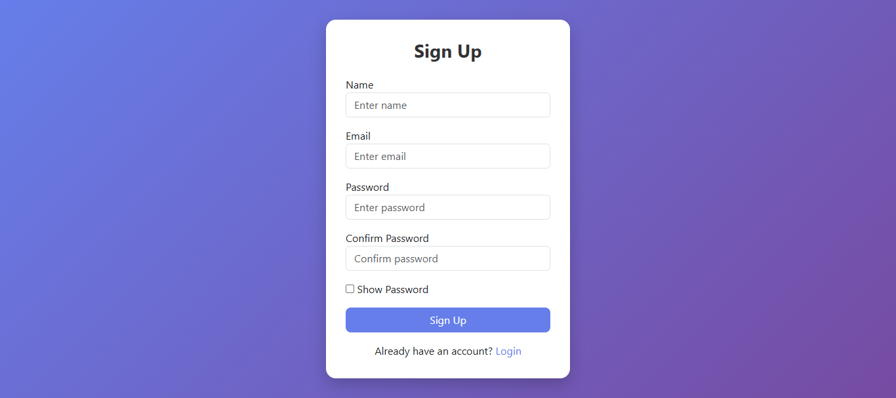
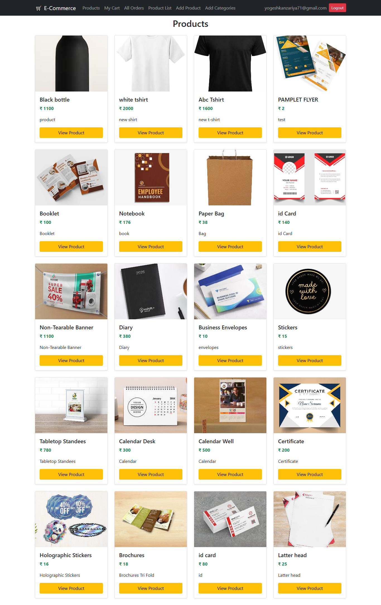
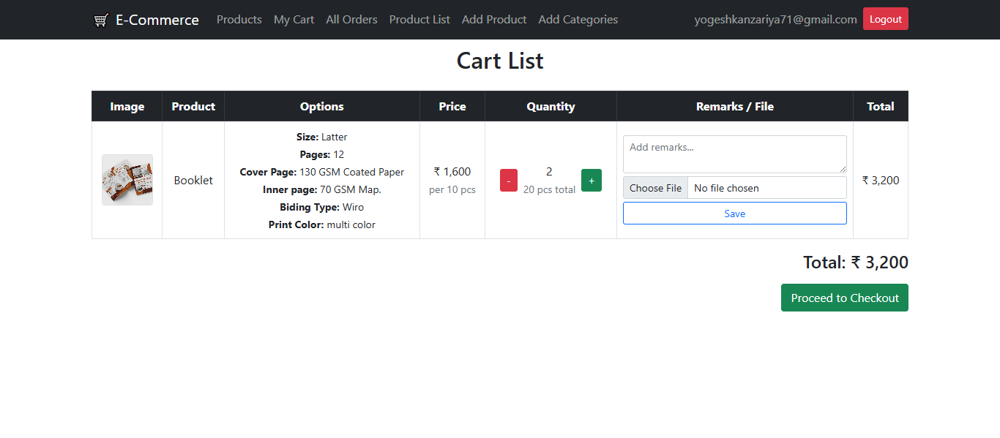
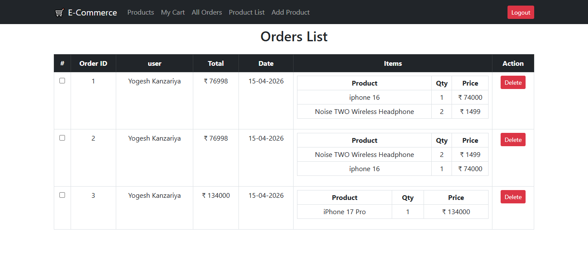
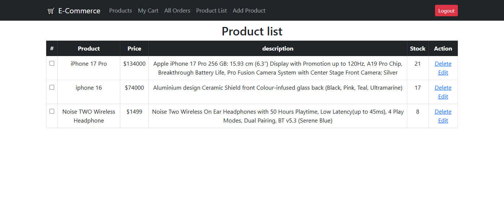
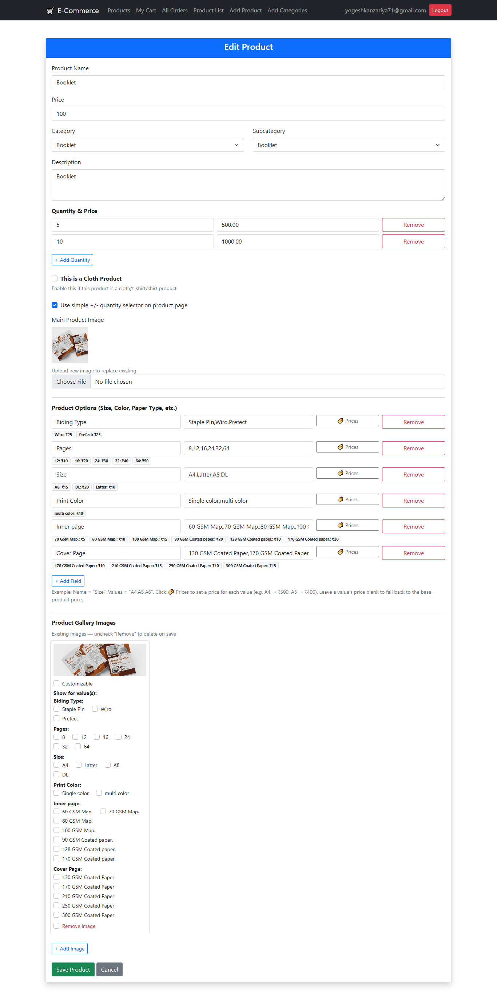

# 🛒 Laravel E-Commerce Project

A simple E-Commerce web application built with Laravel.
This project includes product management, cart system, and order processing with stock handling.

---

## 🚀 Features

### 👤 User

* Login / Logout
* View Products
* Add to Cart
* Increase / Decrease Quantity
* Place Order
* View Orders

---

## 📸 Screenshots

<table>
  <tr>
    <td></td>
    <td></td>
    <td></td>
  </tr>
  <tr>
    <td></td>
    <td></td>
    <td></td>
  </tr>
  <tr>
    <td></td>
  </tr>
</table>

### 🛍️ Products

* Product Listing (Card UI)
* Product Details (Name, Price, Description, Stock, Image)

---

### 🛒 Cart System

* Add product to cart
* Update quantity (+ / -)
* Remove item when quantity = 0
* View total price

---

### 📦 Order System

* Place order from cart
* Auto calculate total
* Store order items
* Reduce product stock
* Prevent order if stock is insufficient

---

### 🔐 Admin Panel

* Add Product
* Edit Product
* Delete Product
* View Product List

---

## 🧠 Tech Stack

* Laravel (Backend)
* MySQL (Database)
* Bootstrap (Frontend)
* Blade Templates

---

## 📂 Project Structure

* `products` → Product listing page
* `cart_items` → User cart page
* `orders` → User order history
* `product_list` → Admin product list
* `product_form` → Add product form

---

## ⚙️ Installation

```bash
git clone https://github.com/yogesh303/laravel_e_commerce.git
cd ecommerce

composer install
cp .env.example .env
php artisan key:generate

# Setup database in .env
php artisan migrate

php artisan serve
```

---

## 🌱 Database Seeder (Admin User)

This project includes a default admin user.

### 👤 Admin Credentials

- Email: yogeshkanzariya71@gmail.com  
- Password: admin123  

---

### ▶️ Run Seeder

```bash
php artisan db:seed


## 🔑 Authentication

* Uses Laravel Auth system
* Role-based access:

  * `admin` → manage products
  * `user` → shop & order

```

---

## 🛡️ Important Logic

### ✔ Cart Handling

* One cart per user
* If product exists → increase quantity

### ✔ Order Processing

* Uses DB Transactions
* Checks stock before order
* Reduces stock after success
* Clears cart after order

---

## 🎯 Future Improvements

* Payment Integration (Razorpay / Stripe)
* Order Status (Pending / Delivered)
* User Profile Page
* Admin Dashboard
* Invoice Generation

---

## 👨‍💻 Developer

**Yogesh Kanzariya**

---

## 📜 License

This project is open-source and free to use.
