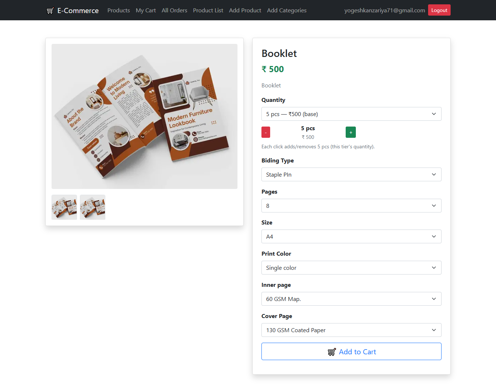
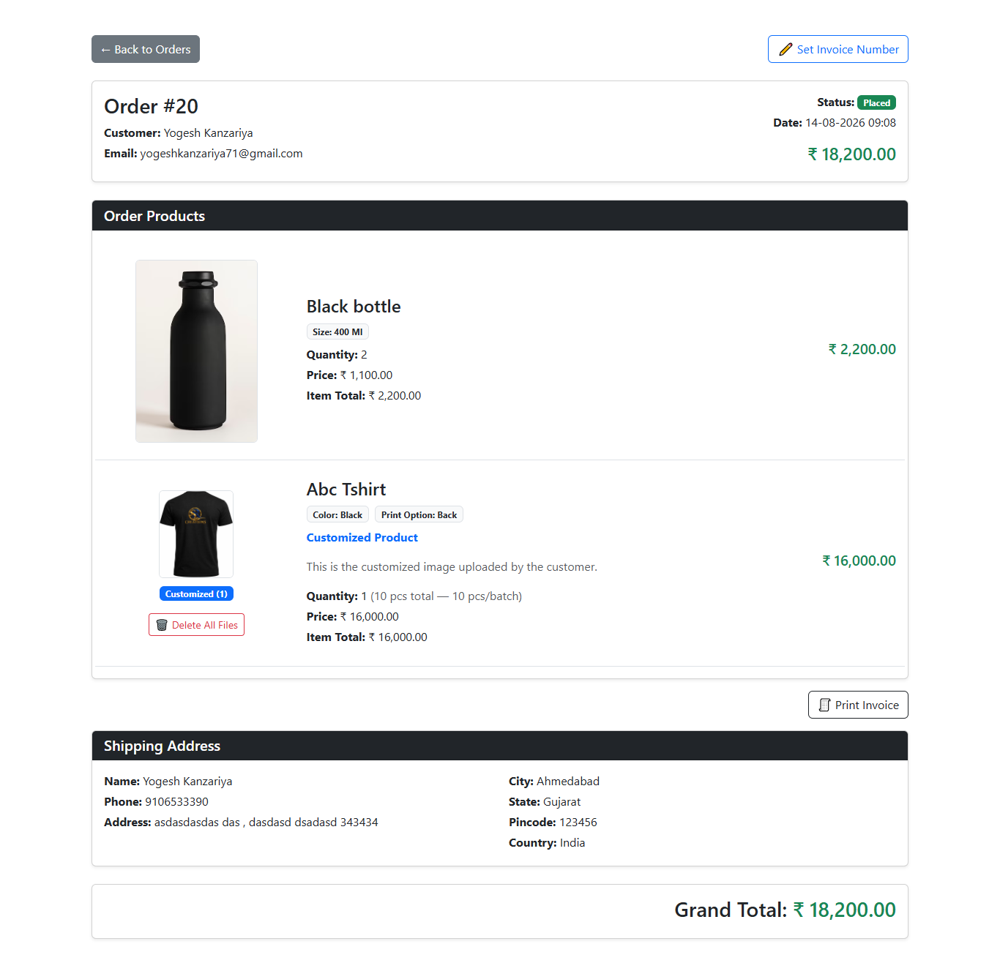
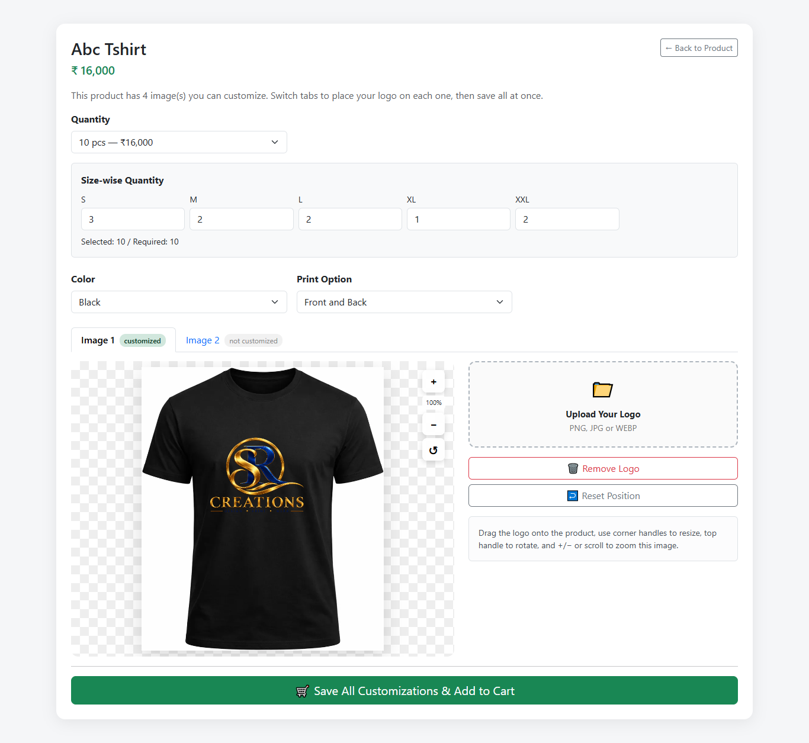

# 🛒 Laravel E-Commerce Project

A full-featured E-Commerce web application built with Laravel.
This project includes product management with dynamic options and pricing, live product customization, cart system, shipping, Razorpay payments, and order processing with stock handling.

---

## 🚀 Features

### 👤 User

* Login / Logout
* View Products
* Add to Cart
* Increase / Decrease Quantity
* Customize Products (upload & place a logo/design on product images)
* Enter Shipping Details
* Pay via Razorpay
* Place Order
* View Orders

---

## 📸 Screenshots

<table>
  <tr>
    <td></td>
    <td></td>
    <td></td>
  </tr>
  <tr>
    <td></td>
    <td></td>
    <td></td>
  </tr>
  <tr>
    <td></td>
    <td></td>
    <td></td>
  </tr>
</table>

---

### 🛍️ Products

* Product Listing (Card UI)
* Product Details (Name, Price, Description, Stock, Image, Gallery)
* **Quantity Tiers** — set multiple quantity/price combinations per product (e.g. 5 pcs ₹1,605, 10 pcs ₹3,100). Customers pick a tier from a dropdown, or use a `+ / −` stepper that moves in multiples of the selected tier's own quantity.
* **Dynamic Product Options** — add any number of custom fields (Size, Color, Paper Type, etc.) with comma-separated values, fully admin-defined per product.
* **Per-Value Option Pricing** — each option value (e.g. `Size: A4`, `A5`) can carry its own price surcharge, set via a popup price editor in the admin form. Surcharge is calculated **per piece** and multiplied by the selected quantity tier automatically, both on the product page and in the cart.
* **Cloth / Size-wise Quantity** — for apparel products, quantity can be split across sizes (S, M, L, XL, XXL), validated against the selected quantity tier.

---

### 🎨 Product Customization

* Per-image customization using Fabric.js — customers can upload their own logo/design and place it on any product image marked as "customizable" by the admin.
* Drag, resize, rotate, and zoom the logo directly on the product preview.
* Admin can tag which images are customizable and restrict them to specific option values (e.g. only show the "Front" image when `Position = Front` is selected).
* Multiple customizable images per product, organized into tabs, with live filtering based on selected options.
* Final composited image and the original uploaded logo are both saved and carried into the cart.
* Live price calculation on the customize page reflects the selected quantity tier and any option surcharges before checkout.

---

### 🛒 Cart System

* Add product to cart (respects selected quantity tier, options, and any customization)
* Update quantity (+ / −)
* Remove item when quantity = 0
* Size-wise cart rows for cloth products, shown as distinct line items
* Add remarks and attach a reference file per cart item
* View item and grand total, including option surcharges

---

### 🚚 Shipping

* Dedicated shipping details form (name, address, phone, etc.) before checkout
* Shipping information carried through to the order

---

### 💳 Razorpay Payment

* Secure payment processing using Razorpay Checkout
* Creates a Razorpay order and opens the hosted/embedded checkout
* Verifies payment signature server-side before confirming the order
* Order is only created after successful payment verification
* Supports test mode and live mode configuration via `.env`

---

### 📦 Order System

* Place order from cart after successful payment
* Auto calculate total (base price + quantity tier + option surcharges + shipping)
* Store order items, selected options, and customization references
* Reduce product stock
* Prevent order if stock is insufficient

---

### 🔐 Admin Panel

* Add Product
* Edit Product
* Delete Product
* View Product List
* Manage Quantity Tiers per product
* Manage Dynamic Options per product
* Set per-option-value pricing via popup editor
* Manage Gallery Images and mark them as customizable / option-triggered

---

## 🧠 Tech Stack

* Laravel (Backend)
* MySQL (Database)
* Bootstrap (Frontend)
* Blade Templates
* Fabric.js (product customization canvas)
* Razorpay (payments)

---

## 📂 Project Structure

* `products` → Product listing page
* `product/{id}` → Product details page
* `product/{id}/customize` → Product customization page
* `cart_items` → User cart page
* `shipping` → Shipping details form
* `orders` → User order history
* `product_list` → Admin product list
* `product_form` → Add / Edit product form (options, quantity tiers, gallery, customization tags)

---

## ⚙️ Installation

```bash
git clone https://github.com/yogesh303/laravel_e_commerce.git
cd ecommerce

composer install
cp .env.example .env
php artisan key:generate

# Setup database in .env
php artisan migrate

php artisan serve
```

---

## 🌱 Database Seeder (Admin User)

This project includes a default admin user.

### 👤 Admin Credentials

- Email: yogeshkanzariya71@gmail.com
- Password: admin123

### ▶️ Run Seeder

```bash
php artisan db:seed
```

---

## 🔑 Authentication

* Uses Laravel Auth system
* Role-based access:

  * `admin` → manage products, options, quantity tiers, gallery
  * `user` → shop, customize, order

---

## 🛡️ Important Logic

### ✔ Cart Handling

* One cart per user
* If the same product + same options + same quantity tier exists → increase quantity
* Different selected options (e.g. different Size) create a separate cart row

### ✔ Pricing Logic

* Base price = product price, or selected quantity tier's price
* Option surcharges are stored **per piece** and multiplied by the tier's quantity before being added to the unit price
* Calculated identically on the product details page, the customize page, and server-side in the cart controller — the server value is always authoritative

### ✔ Order Processing

* Uses DB Transactions
* Checks stock before order
* Reduces stock after success
* Clears cart after order
* Order is only finalized after Razorpay payment is verified

### ✔ Product Customization

* Only images explicitly marked "customizable" by the admin can be personalized
* Trigger values restrict which image is shown for which option selection
* Final canvas export (PNG) and original logo file are both stored against the cart item

### ✔ Stripe and Razorpay Payment

* Secure payment processing using Stripe Checkout
* Creates Stripe Checkout Session
* Redirects users to Stripe's hosted payment page
* Verifies successful payment before creating the order
* Cancels payment safely without affecting the cart
* Supports test mode and live mode configuration via `.env`

---

## 🎯 Future Improvements

* Order Status (Pending / Delivered)
* User Profile Page
* Admin Dashboard
* Invoice Generation

---

## 👨‍💻 Developer

**Yogesh Kanzariya**

---

## 📜 License

This project is open-source and free to use.